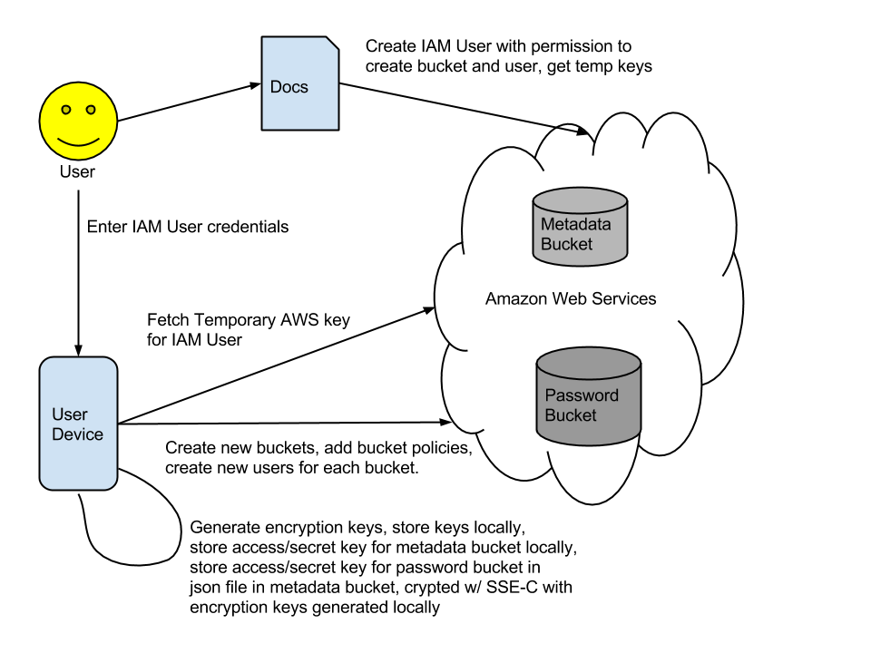
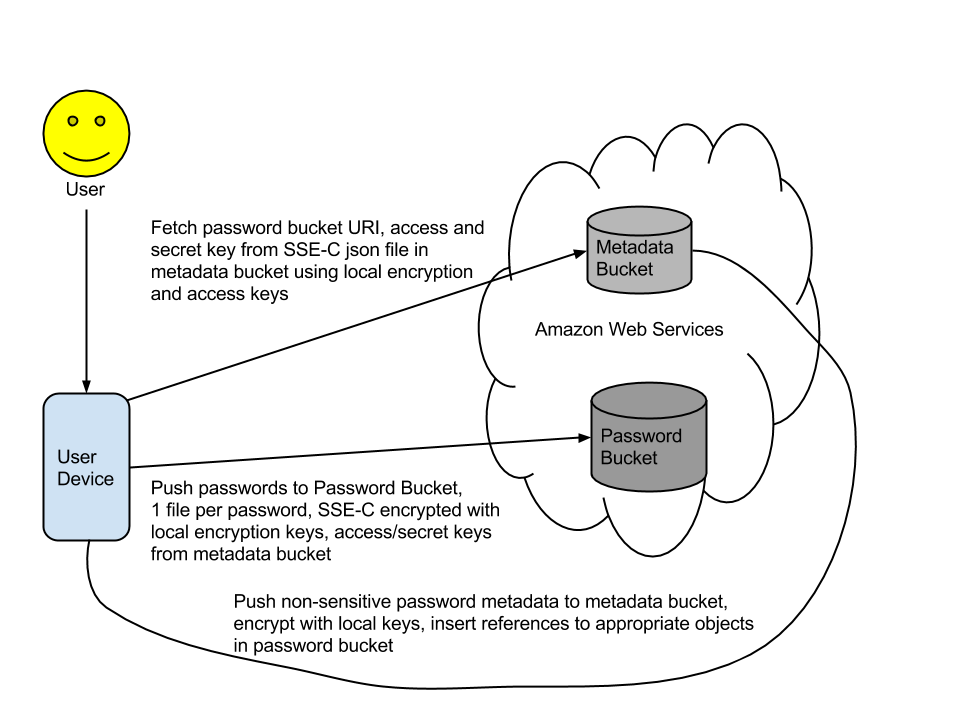

pass3
============

|PyPI|
|Build Status|

An application for storing, retrieving, and managing user passwords. Similar to Lastpass or Keeper, but does not use a centralized service.

How does it work
================

.. |PyPI| image:: https://pypip.in/version/dpath/badge.svg?style=flat
    :target: https://pypi.python.org/pypi/dpath/
    :alt: PyPI: Latest Version

.. |Build Status| image:: https://travis-ci.org/akesterson/pass3.svg?branch=travisci
   :target: https://travis-ci.org/akesterson/pass3
